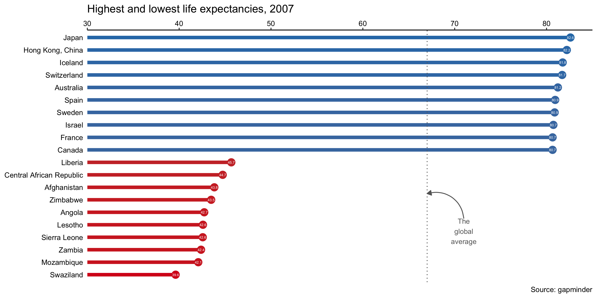

[<kbd>    About    </kbd>](https://atcurry.github.io/page.html)
[<kbd>    Coding    </kbd>](https://atcurry.github.io/coding.html)
[<kbd>    Data Analysis   </kbd>](https://atcurry.github.io/data.html)
[<kbd>    Projects (r)    </kbd>](https://atcurry.github.io/rprojects.html)
[<kbd>    Projects (julia)    </kbd>](https://atcurry.github.io/juliaprojects.html)
[<kbd>    Projects (python)    </kbd>](https://atcurry.github.io)
[<kbd>    Github    </kbd>](https://atcurry.github.io/repos.html)

---

 <h1> 📈 Data Analysis Reports 📉 </h1> 
  

### _Data Analysis Reports with R_
All code written in R, reports written in R Markdown, then exported to HTML.  

- [Investment Report](https://atcurry.github.io/rprojects/InvReport.html) 
- [Languages Report](https://atcurry.github.io/rprojects/LanguagesReport.html)
- [Gapminder Report](https://atcurry.github.io/rprojects/GapminderReport.html)
- [Cars Report](https://atcurry.github.io/rprojects/CarsReport.html)
- [Salmon Report](https://atcurry.github.io/rprojects/FishReport.html)  

 
 
 
 
 
 
 
 

---

 <h2> Recent Projects </h2> 
  

### _The Highest & Lowest Life Expectancies in 2007_
##### _An analysis of the gapminder dataset, visualizing the countries with the 10 highest and 10 lowest life expectancies._

---

### _The Popularity of Stack Overflow Tags Over Time_
##### _A recent analysis in which I used R (dplyr & ggplot) to import, analyse and plot data._

---

### _The Number of Salmon Species Caught Over Time_
##### _An analysis of the number of salmon species caught over time, using ggplot._

---

### _Horsepower of Cars vs Weight & Miles per Galon_
##### _Two graphs plotted with ggplot and then combined, with a line of best fit added with error margins._

---

### _The Price of Diamonds_
##### _A simple ggplot graph showing the price of diamonds vs their carat, coloured by the clarity._

<!-- To update later...
### _Color Comparison of Batman vs Starwars_
##### _An analysis in which I compared the colors used in batman vs star wars. I used R packages dplyr to analyse data and join multiple tables of data together, and then ggplot2 to plot my results._

[Click here for the R code](https://github.com/atcurry/RWorkflow/blob/main/Datasets/LegoColorAnalysis/LegoColorAnalysis.R)

---
-->
