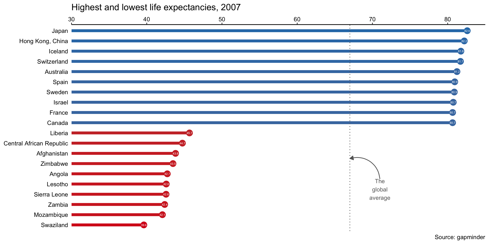
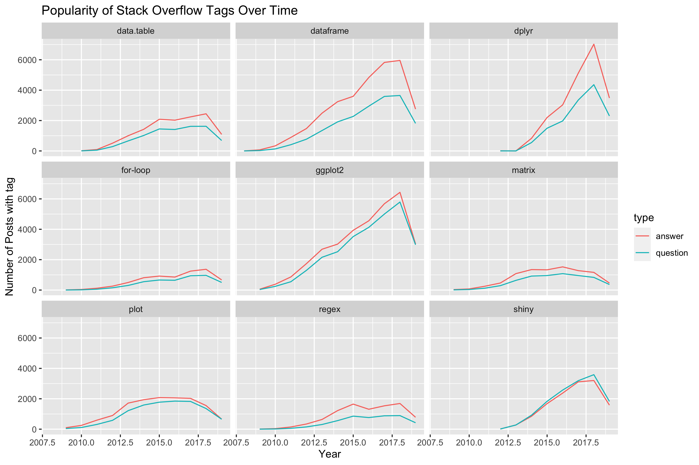
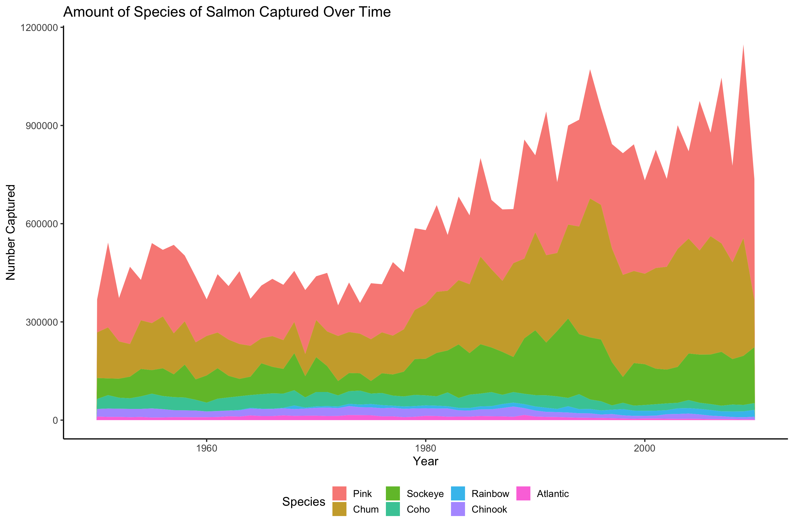
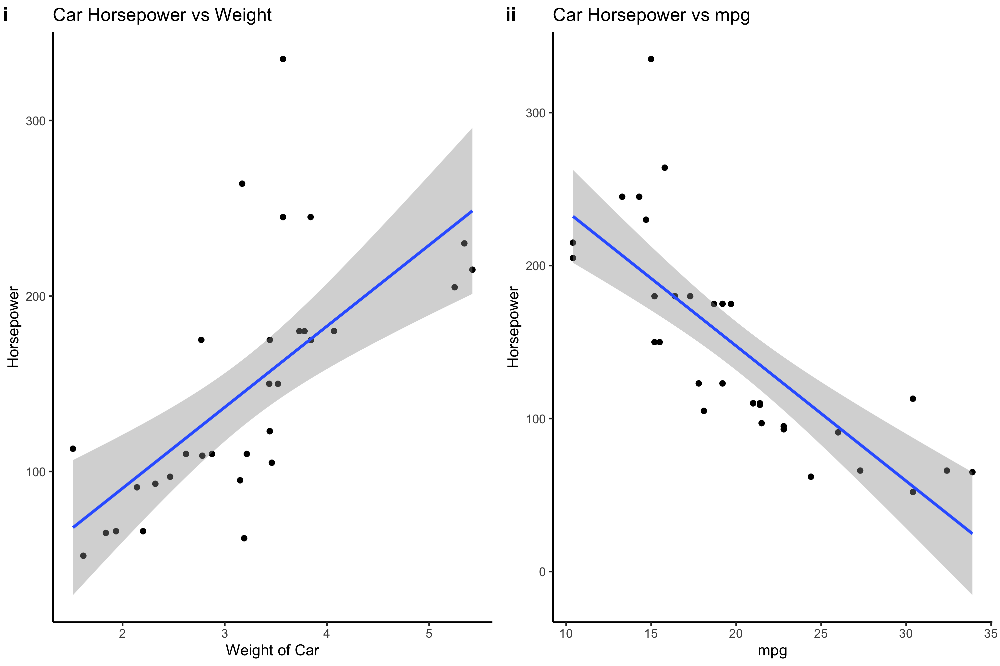
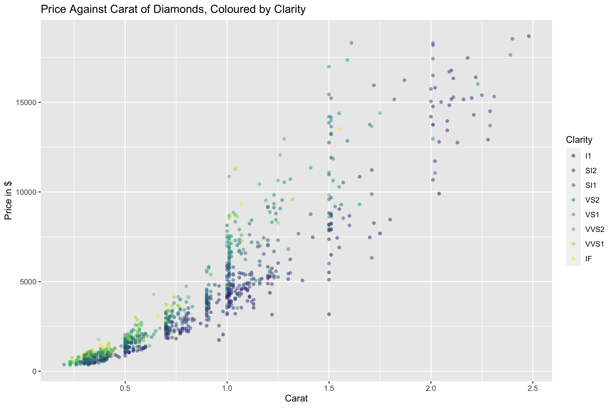

[<kbd>    Home    </kbd>](https://atcurry.github.io)
[<kbd>    About    </kbd>](https://atcurry.github.io/about.html)
[<kbd>    Notes    </kbd>](https://atcurry.github.io/notes.html)
[<kbd>    Coding    </kbd>](https://atcurry.github.io/coding.html)
[<kbd>    Data Analysis   </kbd>](https://atcurry.github.io/data.html)
[<kbd>    Projects (r)    </kbd>](https://atcurry.github.io/rprojects.html)
[<kbd>    Projects (julia)    </kbd>](https://atcurry.github.io/juliaprojects.html)
[<kbd>    Projects (python)    </kbd>](https://atcurry.github.io)
[<kbd>    Repo's    </kbd>](https://atcurry.github.io/repos.html)

---

 <h1> Projects with R </h1> 
  

### _The Highest & Lowest Life Expectancies in 2007_
##### _An analysis of the gapminder dataset, visualizing the countries with the 10 highest and 10 lowest life expectancies._

---

### _The Popularity of Stack Overflow Tags Over Time_
##### _A recent analysis in which I used R (dplyr & ggplot) to import, analyse and plot data._

---

### _The Number of Salmon Species Caught Over Time_
##### _An analysis of the number of salmon species caught over time, using ggplot._

---

### _Horsepower of Cars vs Weight & Miles per Galon_
##### _Two graphs plotted with ggplot and then combined, with a line of best fit added with error margins._

---

### _The Price of Diamonds_
##### _A simple ggplot graph showing the price of diamonds vs their carat, coloured by the clarity._
